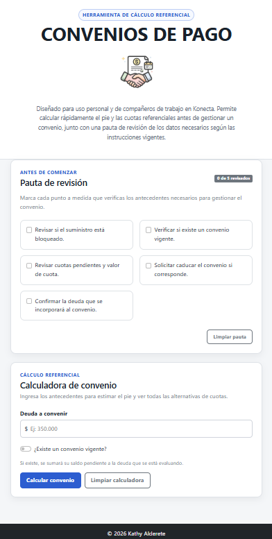
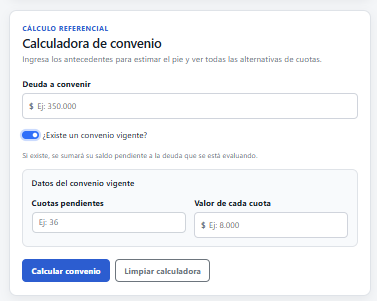

**_<h1 align="center">:vulcan_salute: Asistente de Convenios :computer:</h1>_**

<p>Página web desarrollada con HTML, CSS y JavaScript para calcular de forma rápida y referencial las alternativas disponibles al generar un convenio de pago.</p>
<p align="center">
  <a href="https://kathyalde21.github.io/convenio-de-pagos/">Ver página web del proyecto</a>
</p>

<!-- --------------------------------------------------------- -->

**<h3>📌 Descripción</h3>**

<p>Este proyecto nace como una herramienta práctica para gestionar la propuesta que se entrega a un tercero que está solicitando un convenio de pago.</p>

<p>La idea principal es simplificar cálculos que deben realizarse en poco tiempo, permitiendo ingresar la deuda a convenir y obtener automáticamente el pie correspondiente y las distintas alternativas de cuotas disponibles.</p>

<p>La herramienta también permite considerar un convenio vigente. En ese caso, se ingresan las cuotas pendientes y el valor de cada cuota para calcular su saldo y sumarlo a la nueva deuda antes de realizar el cálculo.</p>

<p>Además, incluye una pauta de revisión que sirve como recordatorio de los antecedentes que deben verificarse antes de gestionar el convenio.</p>

<p>El objetivo es contar con una herramienta simple, rápida y fácil de utilizar durante una atención, sin reemplazar las validaciones ni instrucciones de los sistemas oficiales.</p>

<!-- --------------------------------------------------------- -->

**<h3>✨ ¿Qué permite hacer este sitio?</h3>**

- Ingresar la deuda que se desea convenir.
- Formatear automáticamente los montos ingresados en pesos.
- Indicar si existe un convenio vigente.
- Ingresar las cuotas pendientes y el valor de cada cuota del convenio anterior.
- Calcular automáticamente el saldo pendiente de un convenio vigente.
- Sumar el saldo anterior a la nueva deuda para obtener el monto total considerado.
- Calcular automáticamente el pie correspondiente al 25 %.
- Calcular el saldo restante después del pie.
- Mostrar simultáneamente las alternativas entre 3 y 12 cuotas.
- Validar el límite permitido de 100 UF antes de generar las alternativas de cuotas.
- Informar cuando el monto supera el límite y el cliente debe dirigirse a una sucursal.
- Utilizar una pauta de revisión clickeable antes de comenzar la gestión.
- Limpiar rápidamente los datos para iniciar una nueva atención.

<!-- --------------------------------------------------------- -->

**<h3>🧠 Propósito del proyecto</h3>**

<p>El propósito de este proyecto es agilizar una tarea que normalmente debe realizarse mientras se atiende a una persona y donde el tiempo disponible es limitado.</p>

<p>En lugar de calcular individualmente cada alternativa, la herramienta muestra de una sola vez las opciones entre 3 y 12 cuotas, permitiendo entregar distintas posibilidades de pago sin realizar cálculos repetitivos.</p>

<p>La interfaz fue pensada para ser clara y rápida de utilizar, priorizando la información necesaria para la gestión por sobre elementos innecesarios.</p>

<p>Los valores obtenidos son referenciales, ya que la distribución definitiva de las cuotas es determinada por el sistema utilizado para generar el convenio.</p>

<!-- --------------------------------------------------------- -->

**<h3>⚠️ Consideraciones</h3>**

<p>La herramienta funciona como apoyo para realizar cálculos referenciales y no reemplaza los procedimientos, validaciones o instrucciones vigentes de la empresa.</p>

<p>La validación del límite de 100 UF se realiza de forma automática y no forma parte del cálculo visible para el usuario.</p>

<p>Si existe un convenio vigente, su saldo pendiente se suma a la deuda que se desea convenir antes de realizar la validación del límite permitido.</p>

<p>No es necesario ingresar datos personales del cliente para utilizar la herramienta.</p>

<!-- --------------------------------------------------------- -->

**<h3>🛠 Lenguajes y tecnologías utilizadas</h3>**

<p>
  
  
  
  
</p>

**Lenguajes:**

- HTML5
- CSS3
- JavaScript

**Complementos:**

- Bootstrap 5 para estructura, componentes y diseño responsive.
- API externa para consultar el valor de la UF utilizado en la validación del límite.
- GitHub Pages para publicar la herramienta como sitio web.

<!-- --------------------------------------------------------- -->

**<h3>📷 Vista previa</h3>**

<p>
  
</p>
<p></p>

**<h3>📚 Lo que practiqué en este proyecto</h3>**

- Manipulación del DOM con JavaScript.
- Uso de eventos mediante `addEventListener`.
- Lectura y validación de datos ingresados mediante formularios.
- Formateo automático de valores monetarios.
- Uso de funciones para separar distintas responsabilidades del programa.
- Manejo de estructuras condicionales.
- Generación dinámica de elementos HTML desde JavaScript.
- Creación automática de tarjetas con distintas alternativas de cuotas.
- Uso de `async`, `await` y `fetch` para consultar información externa.
- Validación de datos obtenidos desde una API.
- Manejo de errores y mensajes de alerta.
- Uso de Bootstrap para apoyar la responsividad.
- Uso de CSS personalizado para complementar el diseño de Bootstrap.
- Diseño de una interfaz orientada a agilizar una tarea de uso frecuente.

**<h3>📁 Estructura del Proyecto:</h3>**

```bash
    📁 asistente-convenios
    ├── 🟧 index.html
    ├── 📘 README.md
    └── 📁 assets
        ├── 📁 css
        │   └── 🟦 style.css
        ├── 📁 js
        │   └── 🟨 script.js
        └── 📁 img
            └── 🖼️ icono-convenio-de-pago.png
```
